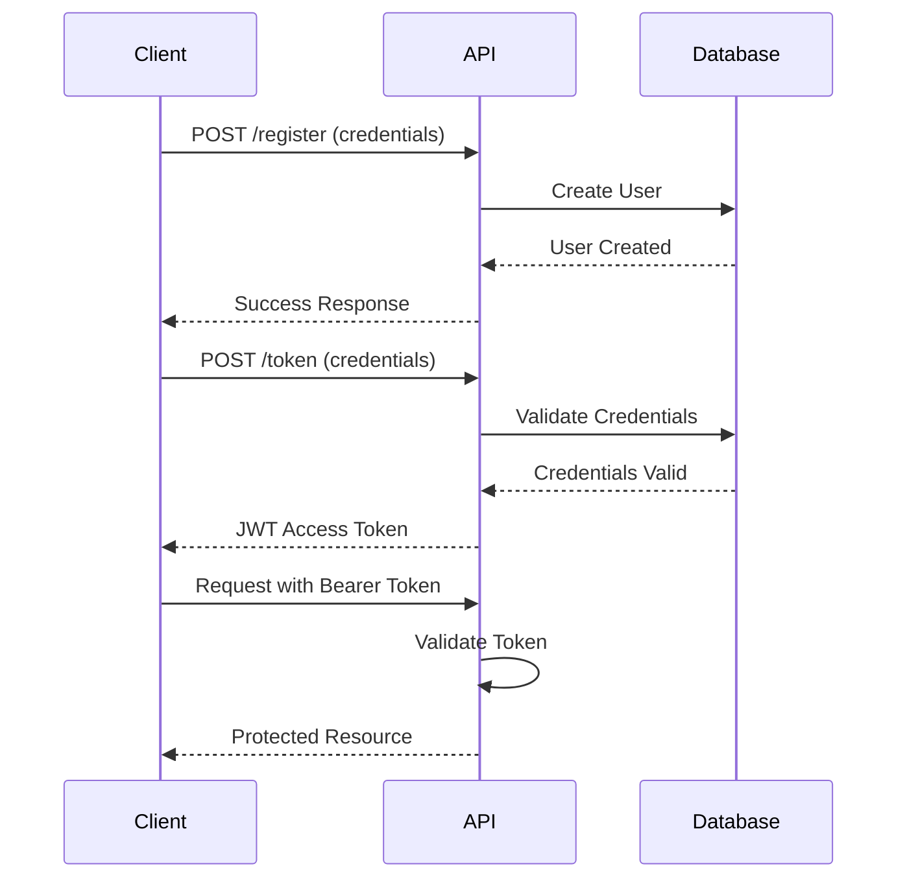

# Authentication API


## Overview

The LMS Platform uses JWT (JSON Web Token) based authentication to secure API endpoints. This approach provides stateless authentication with secure token exchange.

## Authentication Flow



## API Endpoints

### Register

Register a new user in the system.

**Endpoint**: `/register`  
**Method**: `POST`  
**Request Body**:

```json
{
  "username": "string",
  "password": "string"
}
```

**Response**:

```json
{
  "message": "Registered successfully",
  "userId": 123
}
```

### Login (Token)

Obtain an access token.

**Endpoint**: `/token`  
**Method**: `POST`  
**Form Data**:
- `username`: Username
- `password`: Password

**Response**:

```json
{
  "access_token": "eyJhbGciOiJIUzI1NiIsInR5cCI6IkpXVCJ9...",
  "token_type": "bearer"
}
```

## Authentication Code Reference

Here's the auto-generated documentation from the code:

::: server.auth
    options:
      show_root_heading: true
      show_source: true
