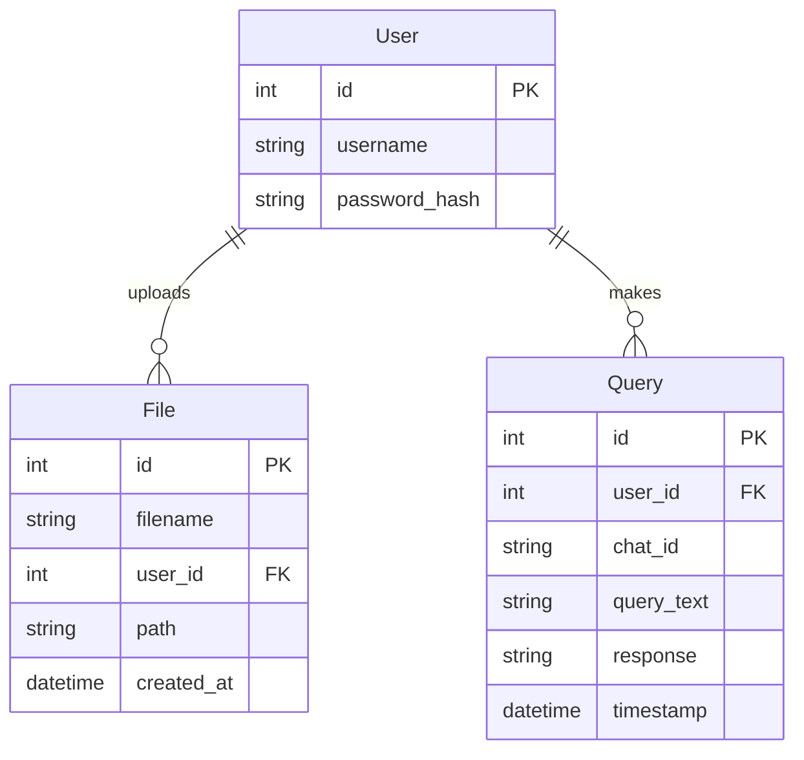

# Database Models

## Overview

The LMS platform uses SQLAlchemy as its ORM (Object-Relational Mapping) layer to interact with a PostgreSQL database. The models defined here represent the database schema and provide an abstraction layer for database operations.

## Database Schema

## Database Models

### User Model

The User model represents a registered user in the system.

::: server.db.User
    options:
      show_root_heading: true
      show_source: true

### Base Model

All models inherit from the SQLAlchemy Base class.

::: server.db.Base
    options:
      show_root_heading: true
      show_source: true

## Database Connection

The database connection is established in the main application and provides a dependency for all routes.

::: server.db
    options:
      show_root_heading: true
      show_source: true
