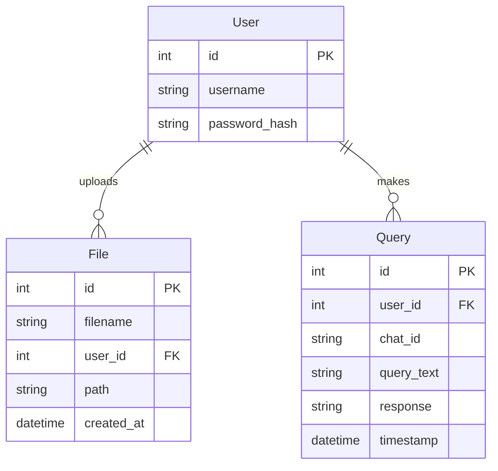

# Database Models

This section documents the database models used in the LMS platform.

## Overview

The LMS uses SQLAlchemy as an ORM (Object-Relational Mapper) to interact with a PostgreSQL database. The database schema consists of several models representing the core entities in the system.

## Entity Relationship Diagram

## Database Models

### User Model

The User model represents a registered user in the system.

::: server.db.User
    options:
      show_root_heading: true
      show_source: true

### Base Model

All models inherit from the SQLAlchemy Base class.

::: server.db.Base
    options:
      show_root_heading: true
      show_source: true

## Database Connection

The database connection is established in the main application and provides a dependency for all routes.

::: server.db
    options:
      show_root_heading: true
      show_source: true
