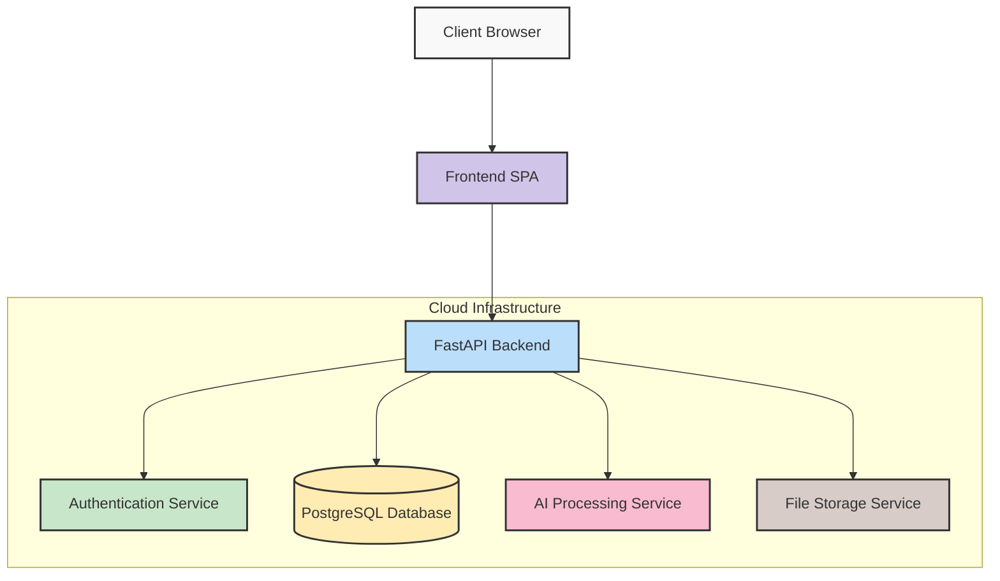
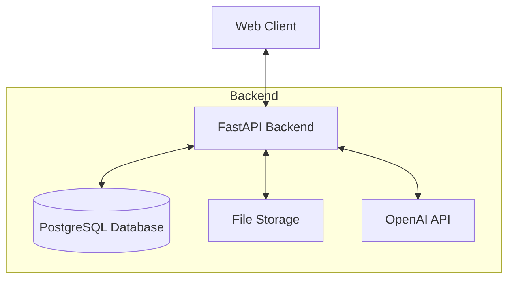
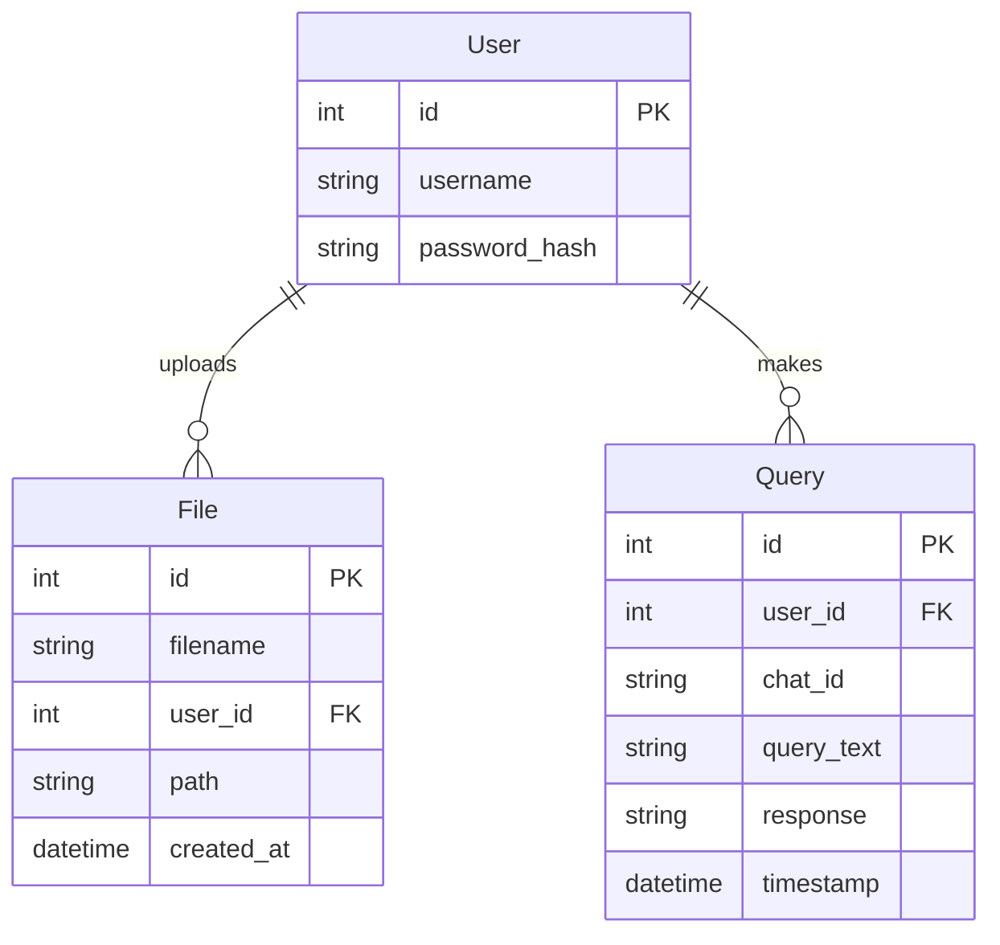
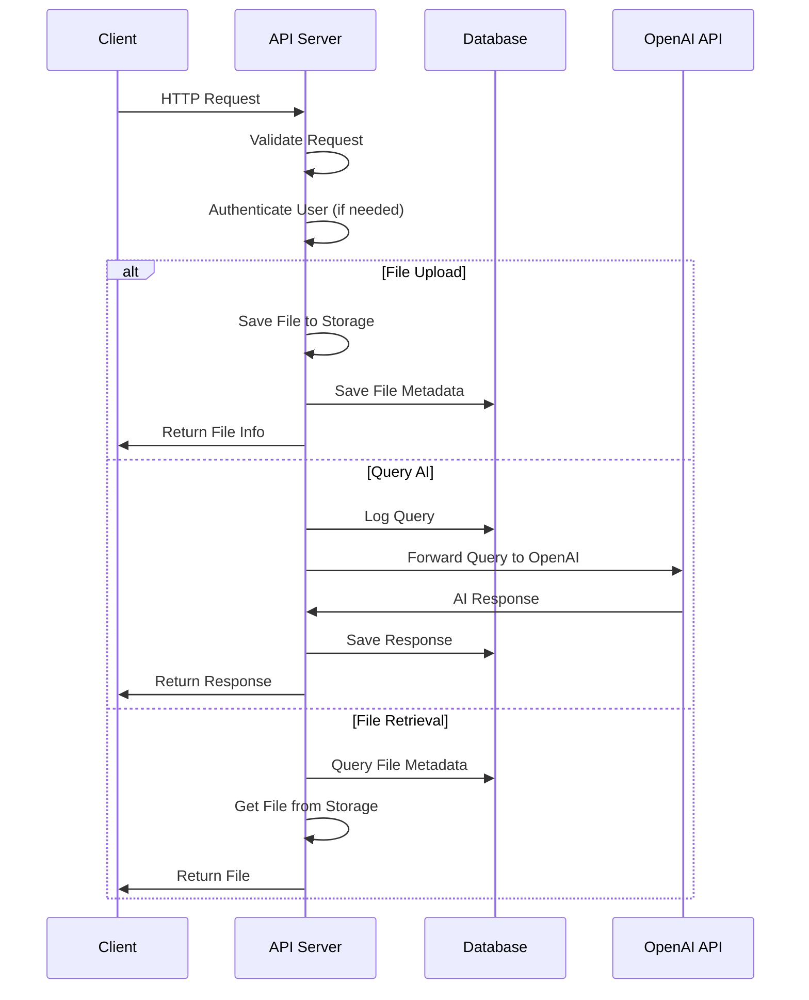
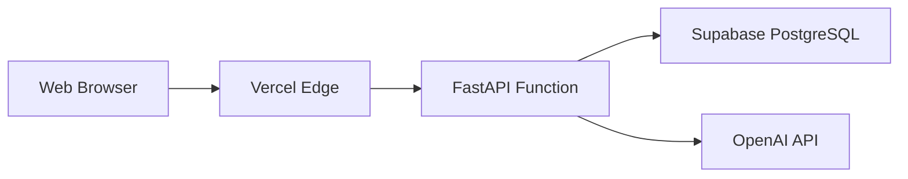

# System Architecture


The LMS platform follows a modern microservices architecture built with Python FastAPI for the backend and a lightweight frontend. This scalable design enables rapid iteration and robust performance.

## System Components



## Key Technologies

<div class="grid cards" markdown>

- :material-api: **FastAPI**  
  High-performance API framework with automatic documentation
  
- :simple-postgresql: **PostgreSQL**  
  Robust relational database for structured data storage
  
- :simple-openai: **OpenAI Integration**  
  AI capabilities for enhanced learning experiences
  
- :simple-vercel: **Vercel Deployment**  
  Serverless infrastructure for scalable performance

</div>

## High-Level Architecture

The LMS is built using a modern web application architecture with a clear separation between backend and frontend components.



## Component Overview

### Backend Components

The backend system consists of several key components:

1. **REST API (FastAPI)**: Handles all HTTP requests
2. **Authentication System**: Manages user credentials and session tokens
3. **Database Layer**: Persists application data
4. **File Management**: Handles file uploads and downloads
5. **OpenAI Integration**: Connects to OpenAI for AI-powered responses

### Database Schema

The database schema represents the core data model:



## Request Flow

The following diagram illustrates a typical request flow through the system:



## Code Organization

The codebase is organized into the following structure:

```
server/
├── main.py         # Application entry point
├── auth.py         # Authentication logic
├── db.py           # Database models and connection
├── routes.py       # API route handlers
└── utils.py        # Utility functions
```

### Core Modules

1. **main.py**: Initializes the FastAPI application, middleware, and routes
2. **auth.py**: Contains authentication logic including JWT token handling
3. **db.py**: Defines SQLAlchemy database models and connection setup
4. **routes.py**: Implements API endpoints and business logic

## Deployment Architecture

In production, the system is deployed on Vercel with a Supabase PostgreSQL database:



## Security Considerations

The LMS implements several security measures:

1. **JWT Authentication**: Secure token-based authentication
2. **Password Hashing**: Passwords are securely hashed using bcrypt
3. **CORS Protection**: Configured to prevent cross-origin attacks
4. **Input Validation**: Request validation using Pydantic models

## Future Architecture Improvements

Potential improvements to consider:

1. **Caching Layer**: Implement Redis for response caching
2. **Message Queue**: Add RabbitMQ/Kafka for async processing
3. **CDN Integration**: Use a CDN for file delivery
4. **Microservices**: Split into domain-specific microservices
5. **Real-time Communication**: Add WebSocket support
