# Contributing Guide


## Welcome to the LMS Community

Thank you for your interest in contributing to the LMS platform! This document provides guidelines and instructions for contributing to the project. Whether you're fixing bugs, adding features, or improving documentation, your contributions are greatly appreciated.

## Development Workflow



```mermaid
flowchart LR
    A[Fork Repository] --> B[Create Branch]
    B --> C[Make Changes]
    C --> D[Run Tests]
    D --> E[Submit PR]
    E --> F[Code Review]
    F --> G[Merge]
    
    style A fill:#d1c4e9,stroke:#333,stroke-width:1px
    style B fill:#c8e6c9,stroke:#333,stroke-width:1px
    style C fill:#bbdefb,stroke:#333,stroke-width:1px
    style D fill:#ffecb3,stroke:#333,stroke-width:1px
    style E fill:#f8bbd0,stroke:#333,stroke-width:1px
    style F fill:#d7ccc8,stroke:#333,stroke-width:1px
    style G fill:#b2dfdb,stroke:#333,stroke-width:1px
```

## Getting Started

1. **Fork the repository** on GitHub
2. **Clone your fork**:
   ```bash
   git clone https://github.com/YOUR-USERNAME/LMS.git
   cd LMS
   ```
3. **Set up your development environment** by following the [Installation Guide](../user-guide/installation.md)
4. **Create a new branch** for your feature or bugfix:
   ```bash
   git checkout -b feature/your-feature-name
   ```

## Development Workflow

### Coding Standards

- Follow PEP 8 style guidelines for Python code
- Use meaningful variable and function names
- Include docstrings for all functions, classes, and modules
- Write unit tests for new functionality

### Docstring Format

Use Google-style docstrings for Python code:

```python
def function_name(param1, param2):
    """Short description of function.
    
    Longer description of function explaining details.
    
    Args:
        param1: Description of param1
        param2: Description of param2
        
    Returns:
        Description of return value
        
    Raises:
        ExceptionType: Description of when this exception is raised
    """
    # Function implementation
```

### Testing

- Write tests for all new features and bug fixes
- Run tests before submitting a pull request:
  ```bash
  pytest
  ```

## Pull Request Process

1. **Update documentation** for any new features or changes
2. **Run all tests** to ensure they pass
3. **Submit a pull request** to the main repository
4. **Address any feedback** from code reviews

## Commit Message Guidelines

Follow the conventional commits specification for commit messages:

- **feat**: A new feature
- **fix**: A bug fix
- **docs**: Documentation only changes
- **style**: Changes that do not affect the meaning of the code
- **refactor**: A code change that neither fixes a bug nor adds a feature
- **perf**: A code change that improves performance
- **test**: Adding missing tests or correcting existing tests
- **chore**: Changes to the build process or auxiliary tools

Example:
```
feat(auth): add password reset functionality
```

## Documentation

When adding or modifying features, make sure to update the documentation:

1. Update relevant documentation in the `/docs` directory
2. Include clear docstrings in your code
3. Add comments for complex logic

## Code Review Process

All submissions require review before being merged:

1. A maintainer will review your pull request
2. Changes may be requested
3. Once approved, your changes will be merged

## Development Environment Setup

For a consistent development environment:

1. Use a virtual environment
2. Install development dependencies:
   ```bash
   pip install -r requirements-dev.txt
   ```
3. Install pre-commit hooks:
   ```bash
   pre-commit install
   ```

## Contact

If you have questions or need help:

- Open an issue on GitHub
- Contact the project maintainers
