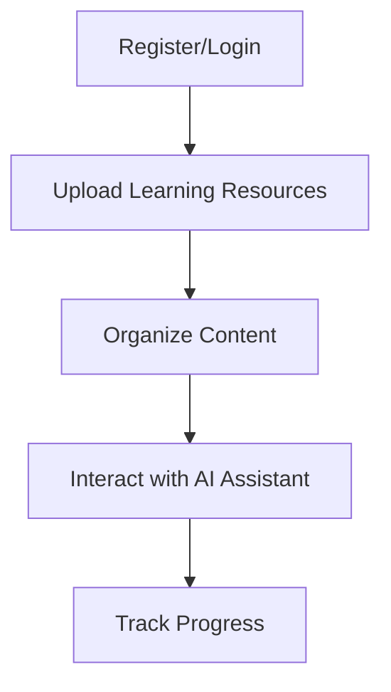

# Getting Started

This guide will help you get started with using the LMS platform.

## Overview

The Learning Management System (LMS) provides a set of tools for managing learning resources, including file management, user authentication, and AI-assisted learning support.

## Prerequisites

Before you begin, make sure you have:

- A modern web browser (Chrome, Firefox, Safari, or Edge)
- Internet connection
- User credentials (or the ability to register a new account)

## Basic Workflow

## First Steps

1. **Register an account** - Use the `/register` endpoint or user interface to create a new account
2. **Log in** - Authenticate using your credentials to receive an access token
3. **Upload your files** - Start uploading learning materials
4. **Query the AI** - Use the AI assistant to help with your learning

## Next Steps

Once you're familiar with the basic functionality, you can:

- Organize your files
- Create learning pathways
- Integrate with external tools and services
- Customize your learning experience

## Tutorial: Basic Usage

### Registration and Login

1. Visit the system at [https://lms-swart-five.vercel.app](https://lms-swart-five.vercel.app)
2. Click on "Register" and enter your username and password
3. After successful registration, log in with your credentials

### File Management

Once logged in, you can:

- Upload files using the "Upload" feature
- View your files in the file list
- Download files as needed
- Delete files you no longer need

### Using the AI Assistant

1. Navigate to the chat interface
2. Enter your question about the learning material
3. Receive AI-generated responses to help with your learning
