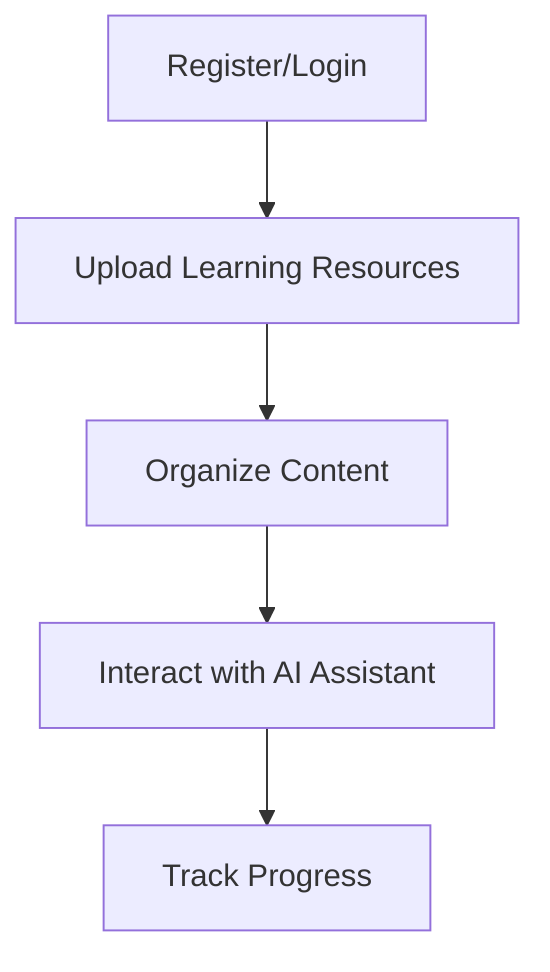

# Getting Started

## Overview

Welcome to the LMS Platform! This guide will help you quickly set up and start using our powerful learning management system.

## Quick Start

=== "For Instructors"
    1. **Create an Account** - Register using your institution email
    2. **Set Up Your Course** - Create a new course and add modules
    3. **Add Content** - Upload learning materials and assignments
    4. **Invite Students** - Generate and share enrollment codes

=== "For Students"
    1. **Create an Account** - Register with your student email
    2. **Join a Course** - Use the enrollment code from your instructor
    3. **Access Materials** - Browse through course content
    4. **Submit Assignments** - Complete and upload assignments

## System Requirements

| Component | Minimum Requirements | Recommended |
| --------- | -------------------- | ----------- |
| Browser   | Chrome 80+, Firefox 72+, Edge 80+ | Latest version |
| Internet  | 1 Mbps connection | 5+ Mbps connection |
| Display   | 1280 x 720 resolution | 1920 x 1080 or higher |
| Disk Space| 100 MB for cached content | 1 GB for offline features |

!!! tip "Pro Tip"
    Enable browser notifications to receive instant updates about grades, announcements, and upcoming deadlines.

## First-time Login

1. Navigate to [https://lms-swart-five.vercel.app](https://lms-swart-five.vercel.app)
2. Click on "Register" to create a new account
3. Verify your email address
4. Complete your user profile
5. Start exploring the platform

## Overview

The Learning Management System (LMS) provides a set of tools for managing learning resources, including file management, user authentication, and AI-assisted learning support.

Before you begin, make sure you have:

- A modern web browser (Chrome, Firefox, Safari, or Edge)
- Internet connection
- User credentials (or the ability to register a new account)

## Basic Workflow

## First Steps

1. **Register an account** - Use the `/register` endpoint or user interface to create a new account
2. **Log in** - Authenticate using your credentials to receive an access token
3. **Upload your files** - Start uploading learning materials
4. **Query the AI** - Use the AI assistant to help with your learning

## Next Steps

Once you're familiar with the basic functionality, you can:

- Organize your files
- Create learning pathways
- Integrate with external tools and services
- Customize your learning experience

## Tutorial: Basic Usage

### Registration and Login

1. Visit the system at [https://lms-swart-five.vercel.app](https://lms-swart-five.vercel.app)
2. Click on "Register" and enter your username and password
3. After successful registration, log in with your credentials

### File Management

Once logged in, you can:

- Upload files using the "Upload" feature
- View your files in the file list
- Download files as needed
- Delete files you no longer need

### Using the AI Assistant

1. Navigate to the chat interface
2. Enter your question about the learning material
3. Receive AI-generated responses to help with your learning
